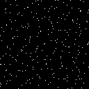
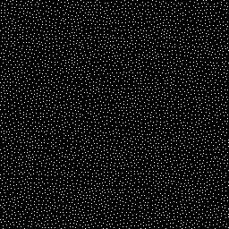

# Blue-Noise
Generating Blue Noise  
FPM library not necessary

# Visualisation
  

# Credits
[MIke Lankamp's](https://github.com/MikeLankamp/fpm) fpm library  
[Sean Barrett's](https://github.com/nothings/stb) stb library  
[Sebastian Wehausen's](https://github.com/s9w/oof) oof library